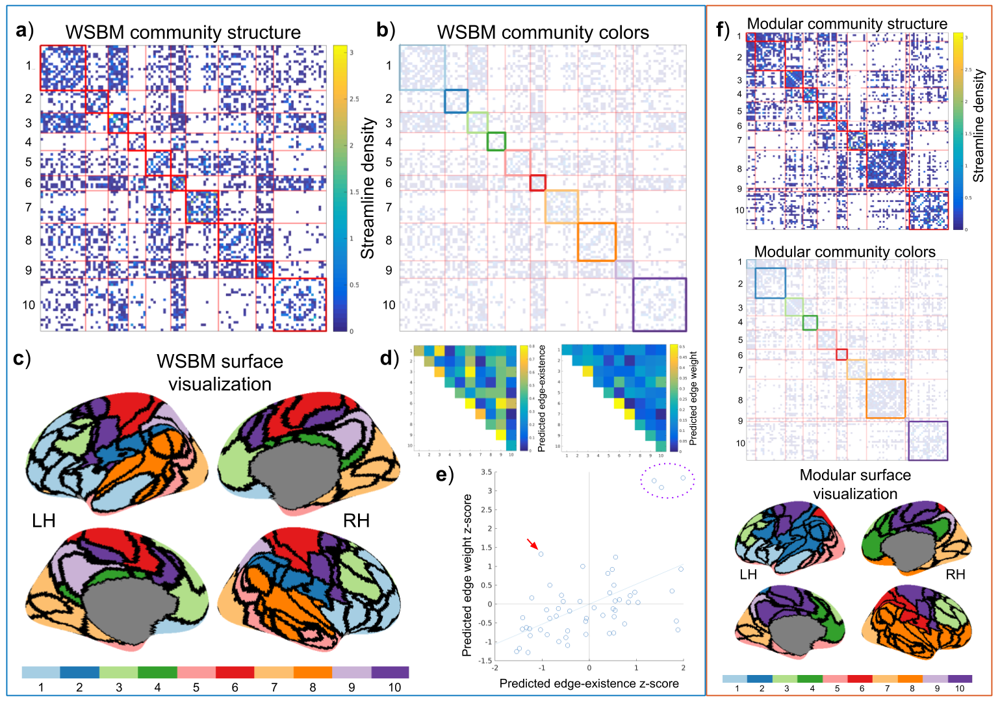

## Faskowitz2018wsbmLifeSpan

This is the code repository for the paper entitled _Weighted Stochastic Block Models of the Human Connectome across the Life Span_ (link). Here you will find code pertaining to data processing and analysis relevant to this paper. The code here was written and run with MATLAB 2016a. 

We have created a standalone set of of MATLAB functions to manipulate and analyse blockmodels of brain network data. This repository is [here](https://github.com/faskowit/blockmodelTools). That should be the preferred repository for utilizing the methods here. This project relies heavily on some external libraries, which are not included here. Importantly, this project utilizes the weighted stochastic block model, code for which is provided [here](http://tuvalu.santafe.edu/~aaronc/wsbm/). 

### Data availability

Data used in this project can be found at the accompanying [figshare repository](https://doi.org/10.6084/m9.figshare.6983018).

### Project Directory Organization

For a better understanding of how this code was run locally, here is the local directory structure:

    .
    ├── config
    ├── data
    │   ├── doc
    │   │   └── assessment_data
    │   ├── external
    │   │   └── Yeo_JNeurophysiol11_SplitLabels
    │   ├── interim
    │   ├── processed
    │   ├── raw
    │   │   └── NKIen1
    │   └── workspace
    ├── reports
    │   └── figures
    │       ├── draft
    │       ├── example_adj_mats
    │       ├── figA
    │       ├── figB
    │       ├── figC
    │       ├── figC2
    │       ├── figC_supp
    │       ├── figE
    │       ├── figF
    │       ├── figG
    │       ├── figL
    │       ├── misc
    │       └── old
    ├── scratch
    └── src
        ├── analysis
        ├── data
        ├── external
        │   ├── 2017_01_15_BCT -> /home/jfaskowi/JOSHSTUFF/scripts/BCT/2017_01_15_BCT/
        │   ├── BrewerMap
        │   ├── CBIG
        │   ├── distPlot
        │   ├── IPN_agreement
        │   ├── knkutils
        │   ├── lifespan
        │   ├── makotoPlot
        │   ├── notBoxplot
        │   ├── panel_2_12
        │   ├── ParforProgMon
        │   ├── rangebar
        │   ├── surfstat
        │   ├── tightfig
        │   ├── tight_subplot
        │   └── WSBM_v1.2
        ├── models
        ├── scripts
        ├── tools
        │   └── unused
        └── visualization
            └── old_viz

    53 directories

 This material is based upon work supported by the National Science Foundation Graduate Research Fellowship under Grant No. 1342962. Any opinion, findings, and conclusions or recommendations expressed in this material are those of the authors(s) and do not necessarily reflect the views of the National Science Foundation. 
